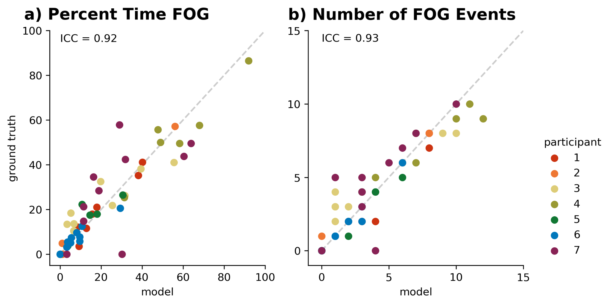


# About The Project

This repository contains de-identified IMU walking data from seven subjects in in-clinic experiments. It also contains code to pre-process, train, and evaluate convolutional neural networks that identify freezing of gait in continuous inertial measurement unit data. The intent of this repository is to provide other researchers tools to develop and train their own FOG detection models.

  

# Installation

Currently, this repo can only be built from source. To do so,

1.  Clone the repo:  
    ```  
    git clone [https://github.com/stanfordnmbl/imu-fog-detection  
    ](https://github.com/stanfordnmbl/imu-fog-detection)cd imu-fog-detection  
    ```
    
2.  Download the prerequisite packages:  
    ```pip install -r requirements.txt```
    

  

# Usage

  

## Data Format

All raw IMU data is formatted in .xslx files (see [data/raw](data/raw)). One file exists for each walking trial. The columns in each data file are: 

subjectID | time (s)  | (6 data channels: ax, ay, az, gx, gy, gz) x (number of IMUs) ... | FOG label (0= nonFOG, 1= FOG)
--|--|--|--|--|--
  |  |  |  |  |

Accelerometer (ax, ay, az) units are m/s$^2$, and gyroscope (gx, gy, gz) units are rad/s. A configuration file is necessary to indicate sensor configurations (see data/imus6_subjects7_configs.xlsx). Column names in the configuration file must be substrings of column names in the raw IMU data files. If the code base will be used, unaltered, .xlsx files will need to be formatted as stated above.

  

## Run IMU sensor experiments [experiments.py](code/experiments.py)

This script creates windowed examples and trains models across all sensor sets specified in the configuration file. Models, weights, and classification metrics are saved to a results directory. Note, on a standard laptop, this could take several hours per sensor set. Run with the commands:

```

cd code

python experiments.py

```

  

## Plot classification metrics [plots.py](code/plots.py)

This script aggregates classification metrics (area under the receiver operating characteristic and average precision) across sensor sets and generates a summary figure. Top-ranked participant sets, as identified through the survey described in the accompanying paper, are also indicated. Run with the commands:

```

cd code

python plots.py

```


[Example of summary figure of classification metrics from [experiments.py](code/experiments.py)]

  

## Calculate clinical metrics [clinical_metrics.py](code/clinical_metrics.py)

This script computes clinical metrics (percent time FOG and number of FOG events) from the single ankle IMU model. It then computes the intraclass correlation coefficient between the ground truth (human) and model-based clinical metrics. A summary figure is generated, and results are saved to the appropriate results directory. Note, on a standard laptop, this could take up to about 30 minutes. Run with the commands:

```

cd code

python clinical_metrics.py

```

  



[Example of summary figure of clinical metrics from human and model generated by [clinical_metrics.py](code/clinical_metrics.py)]

  

## List of Constants

The following constants are found across our code and may be important to consider in your own use:

-   In [datapreprocessing.py](code/datapreprocessing.py):
    

-   FREQ_SAMPLED and FREQ_DESIRED, for resampling purposes.
    
-   N_AUGMENTATION, the number of times to augment each example.
    
-   N_AXES and N_DATA_STREAMS, dependent on the data streams included from the IMUs.
    

-   In [experiments.py](code/experiments.py):
    

-   WINDOW_OVERLAPS, a parameter that can be increased to generate more examples or decreased to generate fewer examples.
    

  

# Citation

Please cite our paper in your publications if our repository helps your research.

```TODO```

  

# Contact

-   Johanna O’Day (odayj@stanford.edu)
    
-   Marissa Lee (marissalee@stanford.edu)
    
-   Kirsten Seagers (kseagers@stanford.edu)
    

  

# License

Distributed under the BSD 3-clause License. See [LICENSE](/LICENSE.txt) for more information.
